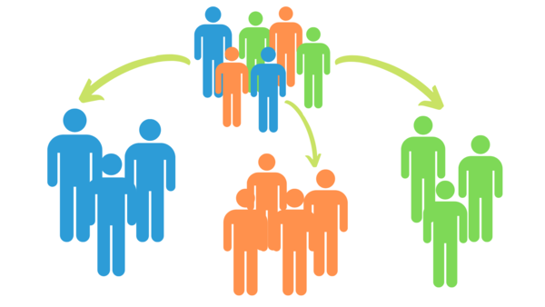

This is the repo in which I post my data science, machine learning and deep learning projects
# Projects :
 - Unsupervised Learning
  	- Analyzing demographics data for customers of a mail-order sales company in Germany, comparing it against demographics information for the general population 
  	- Building an unsupervised learning techniques to perform customer segmentation, identifying the parts of the population that best describe the core customer base of the company
  	- The data that has been provided by our partners at Bertelsmann Arvato Analytics, and represents a real-life data science task
 - Supervised Learning
 	- Analyse demographics information for targets of a marketing campaign for the company, and build a model to predict which individuals are most likely to convert into becoming customers for the company

  

# Project Motivation:

 This project applies Machine Learning algorithms in order to get information about potencial customers out of demographic data. It is the capastone project of the Udacity Machine Learning Engineer Nanodegree program which is provided by Arvato Financial Solutions, a Bertelsmann subsidiary. I chose this project mainly because the data provided is real and almost no cleaning has been done to it. In addition to that, I really enjoy understanding business and customer needs in order to provide best experience for both the company and those who make use of a business product or service.

# Data:

 The data for this project has been provided by Arvato Financial Solutions, a subsidiary of
Bertelsmann in Germany. There are four data files associated with this project as follows:

- Udacity_AZDIAS_052018.csv : Demographics data for the general population of Germany 
	- (891 211 persons (rows) x 366 features (columns))
- Udacity_CUSTOMERS_052018.csv : Demographics data for customers of a mail-order company
	- 191 652 persons (rows) x 369 features (columns)
- Udacity_MAILOUT_052018_TRAIN.csv : Demographics data for individuals who were targets of a marketing campaign
	- 42 982 persons (rows) x 367 (columns)
- Udacity_MAILOUT_052018_TEST.csv: Demographics data for individuals who were targets of a marketing campaign
	- 42 833 persons (rows) x 366 (columns)
- DIAS Information Levels — Attributes 2017.xlsx : Top-level list of attributes and descriptions, organized by informational category
- DIAS Attributes — Values 2017.xlsx: Data values for each variable in alphabetical order 

Note: the DIAS Information Levels and the DIAS Attributes xlsx files has been translated to the data_info.csv file, which contains information regarding the features and their
respective possible values. 

# Libraries 

Pandas, Numpy,Sklearn,Seaborn.Pickle,matplotlib

