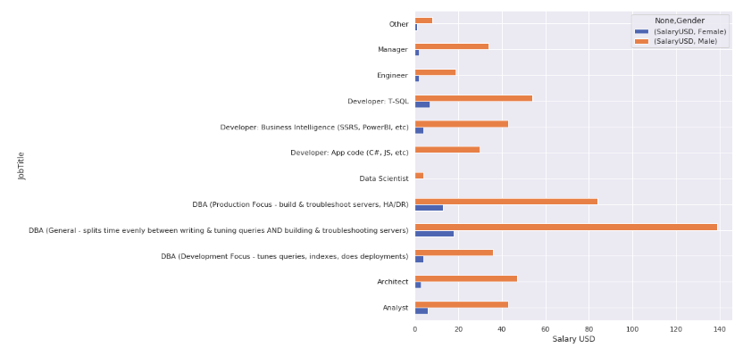

# Project :

 - I used the Brent Ozar salary survey, which is released every year since 2017, as far as I am aware. The main idea here is to answer the following question : Do Females employees make less money than male employees?. Many people would say "Yes! They definitely do!", others might say "Of course female make less money!". Well, it seems to me that when we make this kind of statement, we must be concerned about something called confirmation bias. In other words, if you believe that women are underpaid in comparison to man, there is a chance that you will assume this statement without deep analysis into the quality of the data you are working on.

  

 
 # About me :
 
 I am an electrical engineer turned data scientist who loves leveraging data-driven solutions that make an impact on business and society. My first encounter with data science occurred when I worked as a student researcher at the Applied Computational Intelligence Laboratory (Fluminense Federal University) in which I built Artificial Neural Network models for power forecast.

Thereafter, I won a scholarship that allowed me to study at the University of Toronto in Canada. After this experience, I was given the opportunity to work with electrical projects and project management in a small company in Rio de Janeiro, Brazil. My third working contract involved tasks related to the project management of two electrical substation construction projects in a multinational company.

Right now, I’m currently working on projects related to machine learning and data science which includes customer segmentation, sales prediction and plagiarism detection.
 
