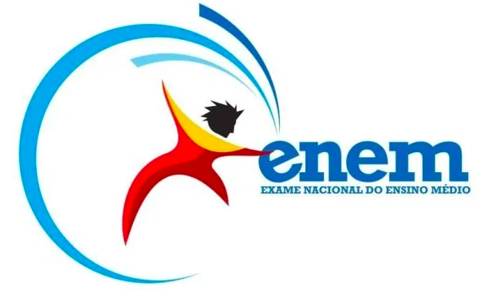

# Predicting Students Grades on ENEM exam (National High School Exam) - 2016

The ENEM is the most important exam in Brazil in which students use their scores to be admitted to a university (specially Federal (and public) Institutions, which usually require really high scores due to their high academic reputation and quality). The exam includes subjects such as Portuguese, History, Geography, Math, Physics, Chemistry and Biology and is taken in two days(weekend).

  

## Data

- Dicionario_Microdados_Enem_2016.xlsx - dictionary with dataset information
- utils.py - Utility file with all functions I built during the project
- Student_grade_prediction.ipynb - Project Notebook

The subject weights

- Mathematics: 3
- natural Science: 2
- Linguages (comunication): 1.5
- Human science: 1
- Essay: 3

# To predict:
 **NU_NOTA_MT**

# About me:

I am an electrical engineer turned data scientist who loves leveraging data-driven solutions that make an impact on business and society. My first encounter with data science occurred when I worked as a student researcher at the Applied Computational Intelligence Laboratory (Fluminense Federal University) in which I built Artificial Neural Network models for power forecast.

Thereafter, I won a scholarship that allowed me to study at the University of Toronto in Canada. After this experience, I was given the opportunity to work with electrical projects and project management in a small company in Rio de Janeiro, Brazil. My third working contract involved tasks related to the project management of two electrical substation construction projects in a multinational company.

Right now, I’m currently working on projects related to machine learning and data science which includes customer segmentation, sales prediction and plagiarism detection.
