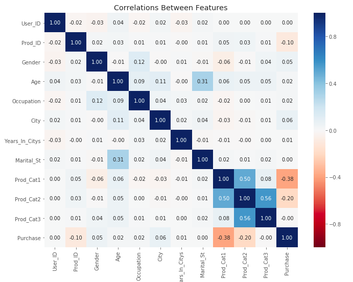

# Understanding-consumer-behavior-on-Black-Friday

# Project :

 - Whether you work in a B2C or D2C company, there is a good chance you be asked to look at some sales dataset in order to create predictive models or to understand consumers behavior. In this project we'll explore some questions we migh want to ask of our data, and how extract those answers as quickly as possible. To do that, we will write a functions to make ou lives easier since we will be plotting a few bar charts in order to answer different questions.

- We'll be using the Black Friday dataset which can be found on Analytics Vidhya website.

  

 
 # About me :
 
 I am an electrical engineer turned data scientist who loves leveraging data-driven solutions that make an impact on business and society. My first encounter with data science occurred when I worked as a student researcher at the Applied Computational Intelligence Laboratory (Fluminense Federal University) in which I built Artificial Neural Network models for power forecast.

Thereafter, I won a scholarship that allowed me to study at the University of Toronto in Canada. After this experience, I was given the opportunity to work with electrical projects and project management in a small company in Rio de Janeiro, Brazil. My third working contract involved tasks related to the project management of two electrical substation construction projects in a multinational company.

Right now, I’m currently working on projects related to machine learning and data science which includes customer segmentation, sales prediction and marketing campaign response ( Identify potential customers).
 
