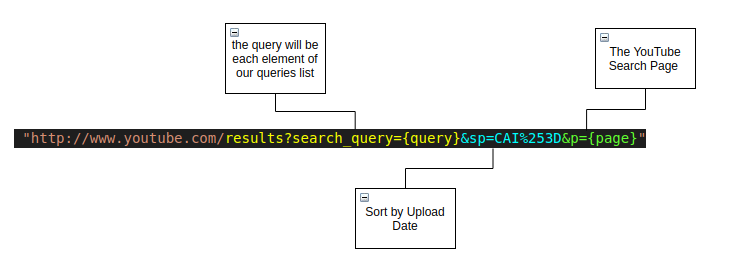

# Youtube Video Recommendation System

# Project :

 - The notebook and Python files provided here, once completed, result in a simple web app which interacts with a deployed model performing a youtube video recommendation system

  

 
 # About me :
 
 I am an electrical engineer turned data scientist who loves leveraging data-driven solutions that make an impact on business and society. My first encounter with data science occurred when I worked as a student researcher at the Applied Computational Intelligence Laboratory (Fluminense Federal University) in which I built Artificial Neural Network models for power forecast.

Thereafter, I won a scholarship that allowed me to study at the University of Toronto in Canada. After this experience, I was given the opportunity to work with electrical projects and project management in a small company in Rio de Janeiro, Brazil. My third working contract involved tasks related to the project management of two electrical substation construction projects in a multinational company.

Right now, I’m currently working on projects related to machine learning and data science which includes customer segmentation, sales prediction and plagiarism detection.

 
Reference : Como Criar uma Solução Completa de Data Science Course - Mario Filho  <a href="https://hotmart.com/product/como-criar-uma-solucao-completa-de-data-science">Link</a>
 
